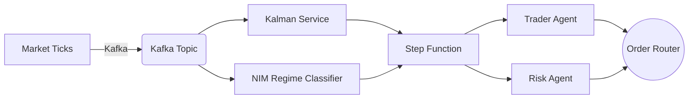
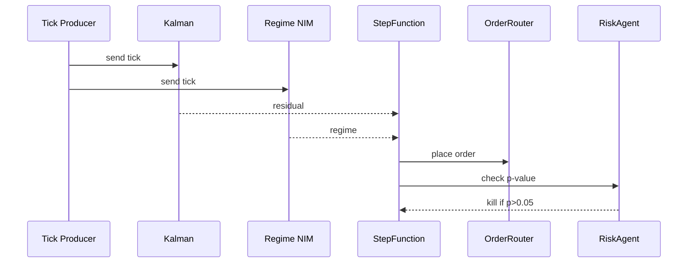
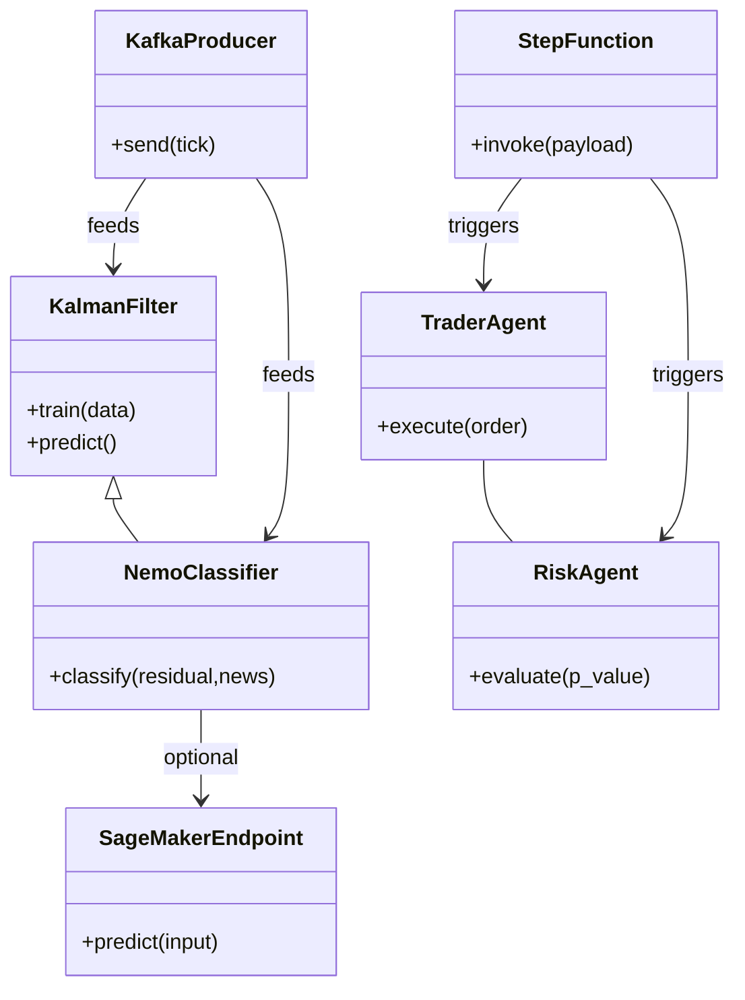
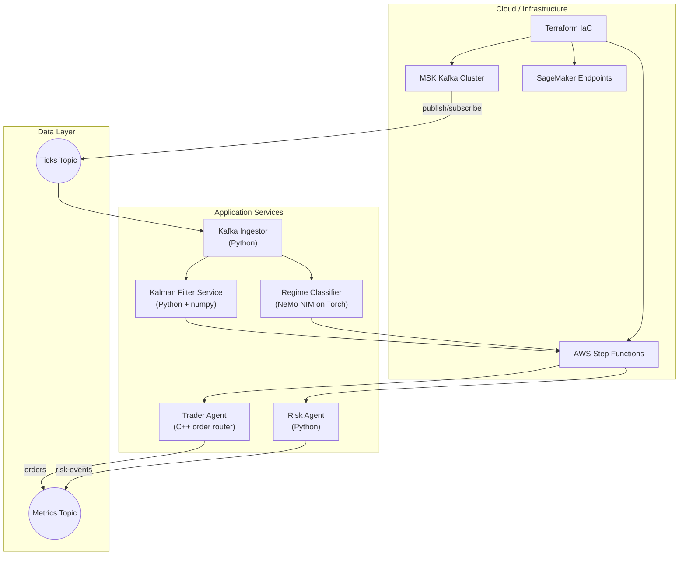
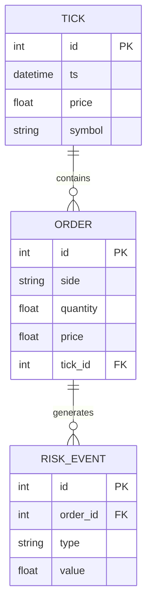

# Architecture

The system is composed of four primary layers:

1. **Data Ingestion** – Kafka/MSK topics receive 100ms ticks or replayed
   dataset.  Producers live in `data_ingestion/`.
2. **Signal Generation** – a Python service computes Kalman-filter
   residuals and a NeMo NIM classifies regime.  Models reside under
   `ml_model/`.
3. **Execution & Risk** – C++/Python engine routes orders and applies
   guardrails.  Code is in `execution_engine/`.
4. **Orchestration & Infrastructure** – Terraform defines MSK, SageMaker
   endpoints, and a Step Function that coordinates Trader and Risk
   agents.

## System Diagram

## Sequence Diagram

## UML Class Diagram

## Extended Architecture & Tech Stack

To make the architecture diagrams more actionable, each component below
is annotated with the primary technologies or tools that implement it.  The
flowchart above was merely illustrative; the following component diagram is
closer to a "standard" architectural sketch with labeled subsystems and
persistence layers.

### Why this version is better

* depicts actual deployment elements (cloud components vs. service boxes)
* uses directional arrows to show publish/subscribe and invocation paths
* separates infrastructure, services, and data layers clearly
* employs familiar shapes (cylinders for topics, rounded rectangles for
  services) akin to UML component or C4 diagrams

### Database / Persistence Schema

Although the current proof‑of‑concept uses Kafka topics instead of a
relational database, a sample schema is provided here to illustrate how one
might persist ticks, orders and risk events in a relational store for
back‑testing or auditing.

### Database / Persistence Schema

Although the current proof‑of‑concept uses Kafka topics instead of a
relational database, a sample schema is provided here to illustrate how one
might persist ticks, orders and risk events in a relational store for
back‑testing or auditing.

---

